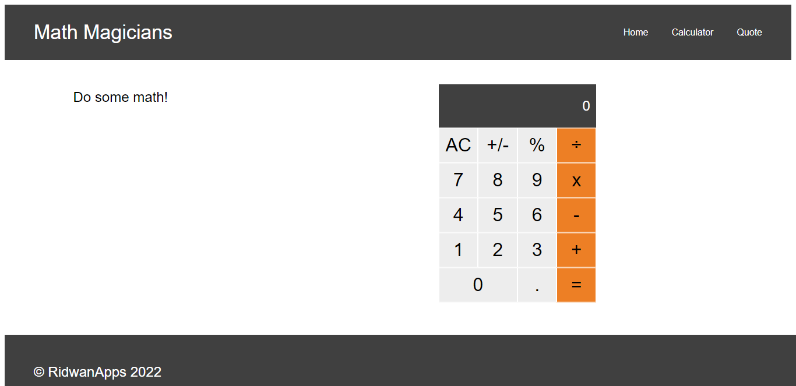

# Math Magicians

## Built With

- React (CRA)

## Milestones

- [✔️] Milestone 1: **Project setup**
- [✔️] Milestone 2: **Components**
- [✔️] Milestone 3: **Events**
- [x] Milestone 4: **Full website**
- [ ] Milestone 5: **Tests**
- [ ] Milestone 6: **Deploy**

## sneak peek

## Getting Started

**Prerequisites:** A Web Browser (preferably FireFox or Chrome)
To get a local copy up and running follow these simple exampl

#### Live demo

[Math Magicians Website](https://ridwanediallo.github.io/Math-magicians/) _Coming Soon_

### **Option 2**

#### Set up your own copy locally

- Clone [the GitHub Repository](https://github.com/ridwanediallo/Math-magicians.git)
- Go to the Project `cd "Math-magicians`
- Run `npm install` to install the _dependencies_
- Run `npm start` to run the live server.
- Run `npm test` to run the tests.

## About me

👤 **Ridwan**

- GitHub: [@githubridwan](https://github.com/ridwanediallo)
- Twitter: [@twitterridwan](https://twitter.com/RidwaneD)
- LinkedIn: [LinkedIn](https://www.linkedin.com/in/ridwan-diallo-9a1634193)

## Contributors

Contributions, issues, and feature requests are welcome!

Feel free to check the [issues page](../../issues/).

## Show your support

Give a ⭐️ if you like this project!

## 📝 License

This project is under the [MIT](./LICENSE) license.
